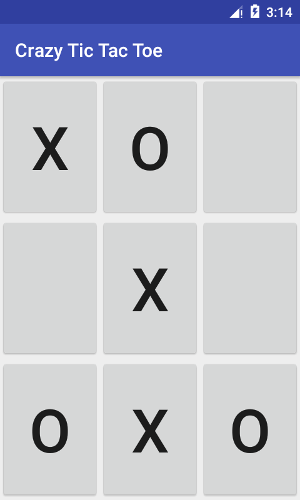
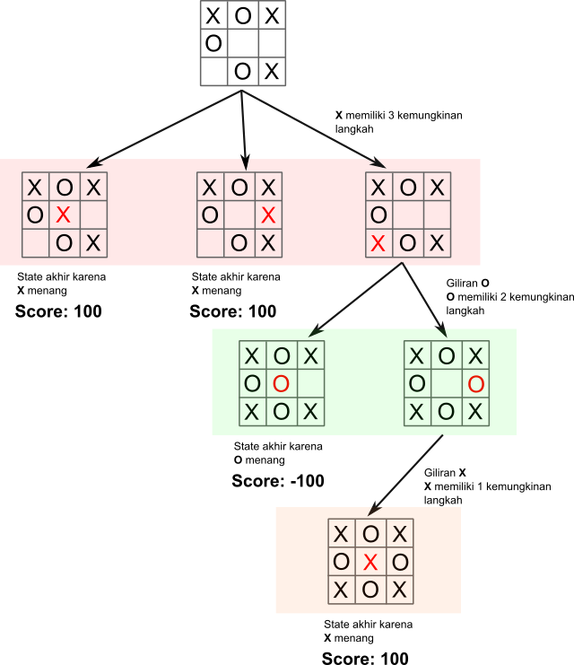
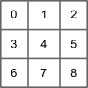
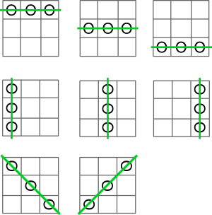

## Apa itu MiniMax
Minimax merupakan suatu algoritma yang digunakan pada pembuatan keputusan dan game theory. khususnya zero-sum game yang dijalankan oleh dua pemain secara bergantian, algoritma ini mencoba untuk mencari langkah yang paling optimal untuk pemain untuk bisa memenangkan permainan, dengan asumsi bahwa lawan juga bermain secara optimal. contoh game ini seperti Tic-Tac-Toe, Backgamon, Catur dsb.

<!--more-->

Pada suatu game, algoritma ini akan menganggap kedua pemain pada game yang disebut **maximizer** dan **minimizer**. **maximizer** mencoba untuk mendapatkan nilai tertinggi, sementara **minimizer** sebaliknya mendapatkan nilai yang terendah untuk mengimbangi **maximizer**.

Artikel ini akan membahas tentang game *tic-tac-toe*, setiap state pada game, dan setiap langkah yang memungkinkan memiliki suatu nilai, dimana nilai tersebut dikalkulasikan secara rekursif sampai ke state akhir/terminal game. untuk **maximizer** agar bisa menang maka nilai yang ingin dia temukan adalah suatu nilai maximum yang merepresentasikan bahwa itu adalah langkah yang optimal, sementara **minimizer** sebaliknya langkah optimal untuk memenangkan permainannya adalah dengan nilai yang rendah.



## Tic-Tac-Toe Game
Asumsi pada state game *tic-tac-toe* terdapat dua pemain **X** dan **O**, dimana **X** adalah **maximizer** player yang mencari nilai *max* dan **O** adalah **minimizer** player yang mencari nilai *min*, state permain digambarkan oleh node root (paling atas), dan pada saat itu adalah giliran **X**.

- Nilai **100** diberikan jika **X** menang.
- Nilai **-100** diberikan jika **O** menang (**X** kalah).
- 0 jika seri.



- Pada game state seperti node root diatas maka **X** akan memiliki 3 kemungkinan langkah yang dapat diambil karena **X** adalah **maximizer** maka dua state pertama yang menghasilkan end/terminal state yang menjadikan **X** menang akan dipilih (salah satu).
- Tetapi jika asumsi **X** memilih langkah ketiga maka dia tidak akan memenangkan game pada saat itu dan gilirian selanjutnya adalah **O**.
- **O** memiliki 2 kemungkinan langkah yang dapat diambil, tentunya karena **O** adalah **minimizer** maka dia akan memilih langkah pertama yang merupakan terminal state dan menjadikannya pemenang game dengan nilai *-100*.
- Tetapi jika dievaluasi lebih lanjut untuk langkah **O** yang kedua maka tidak akan menjadikannya menang, sehingga masuk kegiliran selanjutnya yaitu **X** dimana hanya ada satu *cell* yang dapat diisi dan menjadikannya (**X**) menang dengan nilai *100*.

## Koding

Project android tersedia di [repo github ini](https://github.com/abdularis/TicTacToeSample)

### Papan tic-tac-toe

Papan *tic-tac-toe* merupakan grid dengan jumlah 9 cell, dapat direpresentasikan menggunakan array 1 atau 2 dimensi, disini akan digunakan array 1d dengan jumlah element 9 dari index 0 - 8.



```kotlin
const val BOARD_SIZE = 3
const val EMPTY_TOKEN = 0
private const val ARRAY_SIZE = BOARD_SIZE * BOARD_SIZE

class Board(val data: IntArray = IntArray(ARRAY_SIZE, { EMPTY_TOKEN })) {

    init {
        if (data.size != ARRAY_SIZE) {
            throw IllegalArgumentException(
                    "data array size must have exactly $ARRAY_SIZE elements, current size ${data.size}")
        }
    }

    val isFull: Boolean
        get() {
            for (cell in data) {
                if (cell == EMPTY_TOKEN) return false
            }
            return true
        }

    operator fun get(i: Int) = data[i]
    operator fun set(i: Int, newValue: Int) {
        data[i] = newValue
    }
}
```

### Langkah tic-tac-toe

Buat *class* untuk merepresentasikan langkah-langkah yang dapat diambil pada game dimana nantinya akan digunakan oleh algorithma minimax untuk di kembalikan.

```kotlin
data class Move(
        val index: Int = -1,
        val score: Int = 0
) {
    val isValid inline get() = index >= 0
}
```

### Fungsi skor (evaluation function)

Ini merupakan suatu fungsi yang digunakan untuk mengetahui apakah ada formasi menang (tiga baris token yang sama berturut-turut) untuk suatu pemain atau tidak, pengecekan berlangsung untuk setiap *cell* secara horizontal, vertical dan diagonal.

Jika misalkan player **maximizer** menang maka akan dikembalikan suatu nilai *maximum* (misal 100) sebaliknya jika **minimizer** menang kembalikan nilai *minimum* (misal -100), tetapi jika tidak ada atau belum ada yang menang maka return nilai untuk menandakan seri/draw (misal 0).



```kotlin
class BoardEvaluator {
    companion object {
        const val VAL_MAX = 100
        const val VAL_MIN = -100
        const val VAL_DRAW = 0

        @JvmStatic
        fun evaluate(board: Board, maxPlayer: Int, minPlayer: Int): Int {
            // horizontal
            for (i in 0..6 step 3) {
                if (board[i] == board[1 + i] && board[1 + i] == board[2 + i]) {
                    if (board[i] == maxPlayer) return VAL_MAX
                    else if (board[i] == minPlayer) return VAL_MIN
                }
            }

            // vertical
            for (i in 0..2) {
                if (board[i] == board[3 + i] && board[3 + i] == board[6 + i]) {
                    if (board[i] == maxPlayer) return VAL_MAX
                    else if (board[i] == minPlayer) return VAL_MIN
                }
            }

            // diagonal
            if (board[0] == board[4] && board[4] == board[8]) {
                if (board[0] == maxPlayer) return VAL_MAX
                else if (board[0] == minPlayer) return VAL_MIN
            }

            if (board[2] == board[4] && board[4] == board[6]) {
                if (board[2] == maxPlayer) return VAL_MAX
                else if (board[2] == minPlayer) return VAL_MIN
            }

            return VAL_DRAW
        }
    }
}
```

### Algoritma Minimax

Ini merupakan implementasi basic yang tidak memiliki *tuning* apaput, misalkan bisa saja ditambahkan parameter *depth* untuk menghitung atau membatasi kedalaman traversal tree yang dilakukan dsb. Algoritma ini memang cukup membingungkan pertama kali dan memang cukup sulit untuk di*debug* atau di*trace* karena pemanggilan fungsi yang rekursif dengan jumlah yang cukup besar.

```kotlin
class GameAi(val maxPlayer: Int, val minPlayer: Int) {

    fun findBestMove(board: Board, player: Int): Move = minimax(board, player)

    private fun minimax(board: Board, player: Int): Move {
        val score = BoardEvaluator.evaluate(board, maxPlayer, minPlayer)
        // cek end state
        if (board.isFull || score == BoardEvaluator.VAL_MAX || score == BoardEvaluator.VAL_MIN) {
            return Move(score = score)
        }

        // iterasi cell yang kosong pada board
        val moves = ArrayList<Move>()
        for (i in 0 until board.data.size) {
            // skip jika cell tidak kosong
            if (board[i] != 0) continue
            board[i] = player
            // ganti player secara bergiliran
            val move = if (player == maxPlayer)
                minimax(board, minPlayer) else
                minimax(board, maxPlayer)
            board[i] = EMPTY_TOKEN
            moves.add(Move(i, move.score))
        }

        // ambil langkah max/min
        val bestMove = if (player == maxPlayer) {
            moves.maxBy { it.score }
        } else {
            moves.minBy { it.score }
        }
        return bestMove ?: Move()
    }
}
```

Fungsi `findBestMove()` merupakan public API untuk menyembunyikan implementasi `minimax()`. terdapat dua parameter untuk fungsi `minimax(board: Board, player: Int)`.

Pertama evaluasi apakah pada saat itu state board merupakan *terminal node (end game)* jika score yang dikembalikan sama dengan value *max/min* berarti pada formasi board tersebut terdapat player yang menang (**maximizer** atau **minimizer**), jika didalam board tidak ada lagi cell yang kosong maka permainan memang berakhir (karena tidak ada lagi langkah yang bisa diambil).

Variable `moves` digunakan untuk menyimpan setiap langkah yang memungkingkan untuk diambil oleh *player* pada saat itu.

Iterasi dan *skip* setiap cell yang ada pada board jika tidak kosong. Jika kosong itu artinya dapat menjadi kemungkinan langkah yang bisa diambil.

Karena pada saat ini misalkan adalah giliran **maximizer** dan dia telah menandai board pada index yang kosong tersebut dengan dirinya, maka setelah itu adalah giliran **minimizer** dengan memanggil kembali fungsi `minimax()` (rekursif) dengan parameter *player* untuk player **minimizer** (begitu pula selanjutnya secara bergantian).
Karena proses ini sama halnya seperti simulasi maka kosongkan kembali board pada index tersebut dengan menandainya menggunakan *empty token* (dalam hal ini `EMPTY_TOKEN`).

Jika proses iterasi sudah selesai dan kita memiliki list langkah-langkah yang dapat diambil (`moves`) maka tahap selanjutnya adalah menyaring langkah mana yang dianggap terbaik berdasarkan apakah `player` merupakan **maximizer** atau **minimizer**, jika **maximizer** maka ambil langkah dengan skor yang tertinggi (`move.score`), sebaliknya jika **minimizer** ambil yang terendah.

## References
- [https://en.wikipedia.org/wiki/Minimax](https://en.wikipedia.org/wiki/Minimax)
- [https://www.geeksforgeeks.org/minimax-algorithm-in-game-theory-set-1-introduction/](https://www.geeksforgeeks.org/minimax-algorithm-in-game-theory-set-1-introduction/)
- [https://www.geeksforgeeks.org/minimax-algorithm-in-game-theory-set-2-evaluation-function/](https://www.geeksforgeeks.org/minimax-algorithm-in-game-theory-set-2-evaluation-function/)
- [https://www.geeksforgeeks.org/minimax-algorithm-in-game-theory-set-3-tic-tac-toe-ai-finding-optimal-move/](https://www.geeksforgeeks.org/minimax-algorithm-in-game-theory-set-3-tic-tac-toe-ai-finding-optimal-move/)
- [https://www.neverstopbuilding.com/blog/2013/12/13/tic-tac-toe-understanding-the-minimax-algorithm13](https://www.neverstopbuilding.com/blog/2013/12/13/tic-tac-toe-understanding-the-minimax-algorithm13)
